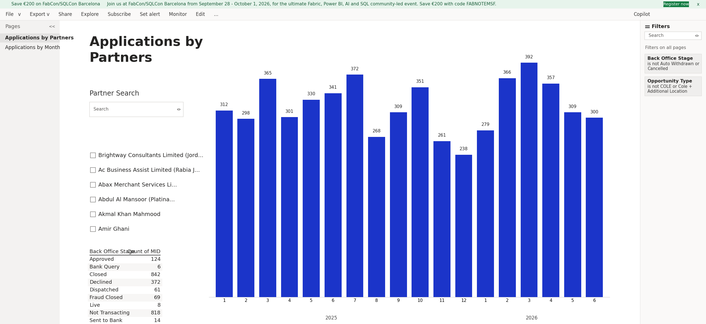
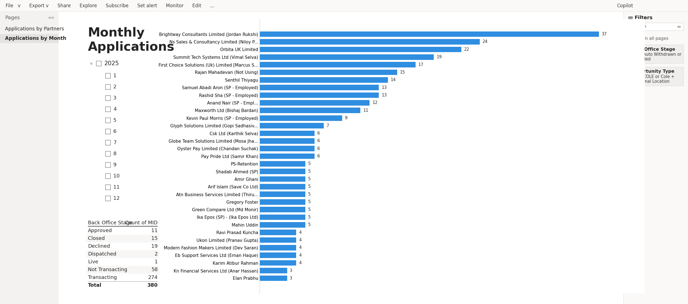
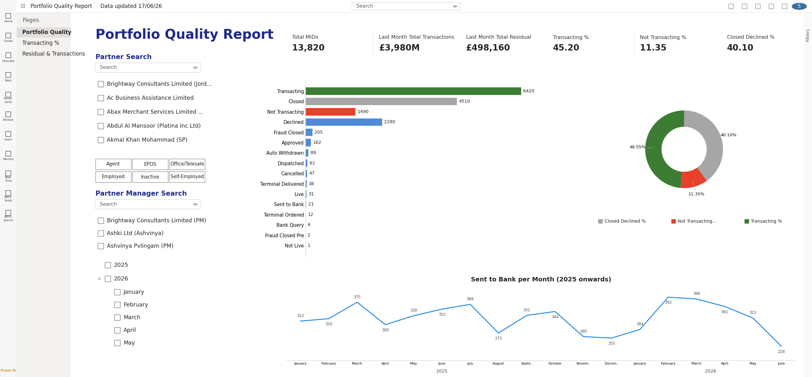
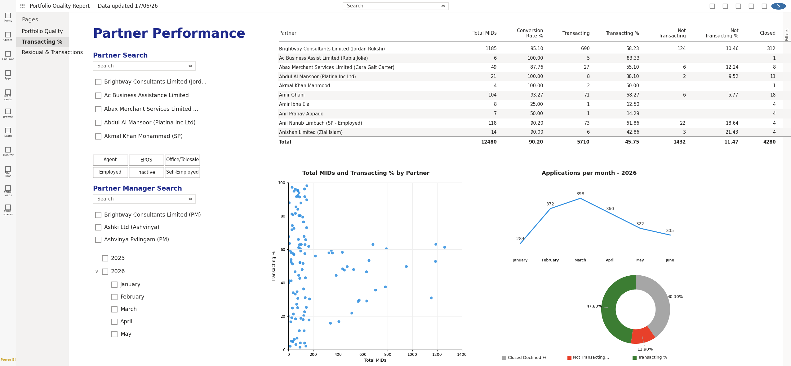

# Merchant Portfolio Analytics — Power BI

A multi-page Power BI suite tracking merchant applications by partner and
month, partner-level conversion / transacting / closed-declined KPIs,
back-office pipeline stages, and residual & transaction trends across a large
payments estate.

## Overview

These dashboards turn raw application, partner and portfolio data into a single
operational view. The model joins application records, partner reference data
and portfolio status feeds, then surfaces the metrics the business uses to
manage merchant onboarding and partner performance — how many applications each
partner sends, how those applications progress through the pipeline, how many
ultimately transact, and how the resulting portfolio trends over time.

## Pages

- **Applications by Partners** — application volume broken down by partner.
- **Monthly Applications** — application trend over time.
- **Portfolio Quality** — back-office pipeline stages and portfolio health.
- **Partner Performance** — partner-level conversion, transacting and
  closed/declined KPIs, with residual & transaction trends.

## Dashboards

## Tech

Power BI, DAX, data modelling.

## Note

All names and figures shown are anonymised/illustrative — no real merchant,
partner or customer data.
